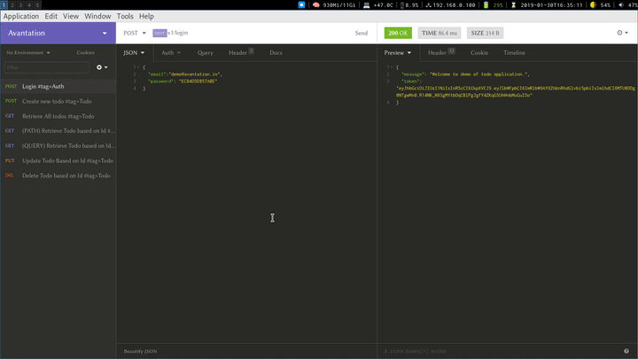

# Build status

* Linux [](https://avantation.in)
* Windows [](https://avantation.in)

# avantation

Avantation is a tool for programmers.
Designed for programmers to generate documentation for REST API&#39;s applications.

avantation is written and maintained by Anbarasan K (anbu@nullobject.io).

[](https://npmjs.org/package/avantation) [](https://npmjs.org/package/avantation) [](https://github.com/anbuksv/avantation/blob/master/package.json)

* Project home page: https://avantation.in/
* Code home page: https://github.com/anbuksv/avnatation
* Issue tracker: https://github.com/anbuksv/avantation/issues

# Building

avantation required nodejs 8.0.0 or higher.

    npm install -g avantation

# Features
* OpenAPI 3.0 Support
* URL Path map regex Support
* Support JSON and YAML
* JWT Authentication Support
* Customer Headers map Support
* Code Sample Generation Support
* Grouping APIs Support
* Static UI Support

# Usage
```sh-session
$ avantation [options]

OPTIONS
  -b, --base-path=base-path                (required) API host base path. Example:['api/v1']
  -h, --host=host                          (required) Host Name
  -j, --json                               Output will be in JSON format
  -o, --out=out                            [default: ./avantation.yaml] Destination path of documentation
  -p, --pipe                               Pipe the result into next command
  -r, --path-param-regex=path-param-regex  [default: [0-9]|[-$@!~%^*()_+]] Convert Regex matching params into dynamic path
  -s, --security-headers=security-headers  [default: {}] Custom Securtity Headers configurarion.(SecuritySchemeObject as per OAS3.0)
  -t, --template=template                  OAS3.0 Template path location
  --disable-static-ui                      disable the static ui file generation process.
  --disable-tag                            Diable API's grouping based on route path
  --har=har                                (required) har file path
  --man                                    print manual.
  --static-ui-logo=static-ui-logo          Static UI logo file location.
```

# Demo
## Existing Projects ([Video](https://youtu.be/GCVbpuKXCMg))


## New Projects ([Video](https://youtu.be/AaUnt2V_3Gk))
